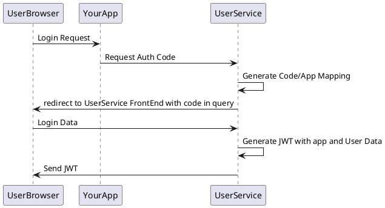

# UserService
A User and Authentication and Authorization Service

## Needed ENVs:
```
PORT=YOUR_PORT
MONGO_HOST=YOUR_MONGO_HOST
MONGO_PORT=YOUR_MONGO_PORT (Default: 27017)
MONGO_USER=YOUR_MONGO_USER
MONGO_PASSWORD=YOUR_MONGO_USER_PASSWORD
JWT_SECRET=SECRET_FOR_WEB_TOKENS
MAIL_HOST=EMAIL_SMTP_HOST_FOR_MAIL_SENDING
MAIL_PORT=EMAIL_SMTP_PORT (587)
MAIL_ADDRESS=EMAIL_ADDRESS_FOR_EMAIL_SENDING
MAIL_PASSWORD=EMAIL_PASSWORD
MAIL_DISPLAY_NAME=EMAIL_DISPLAY_NAME
RESET_TOKEN_PRE_URL=URL_FOR_PASSWORD_RESET_TOKEN (my.frontend.com/reset => my.frontend.com/reset?email=user@mail.com&token=123456789)
VERIFY_TOKEN_PRE_URL==URL_FOR_PASSWORD_USER_Verification (my.frontend.com/verify => my.frontend.com/verify?email=user@mail.com&token=123456789)
INITIAL_USER={"name": "Init User Name", "email":"user@mail.com", "password": "SuperSavePassword"}
FRONT_END_LOGIN_URL=URL_TO_USER_SERVICE_FRONTEND
```

## Auth:
